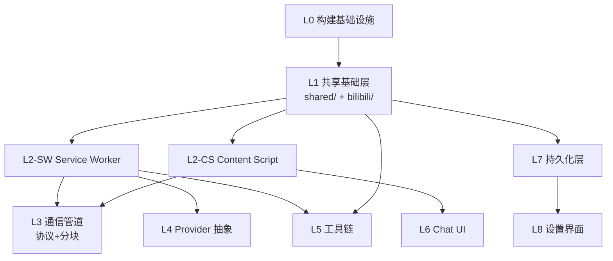

# BiliGo 模块设计

## 文档概述

本文档详细描述 BiliGo 各层（L0-L8）的模块划分、模块职责、依赖关系、目录结构以及核心模块的伪代码实现。它是《系统架构.md》的细化，供开发团队在编码时直接参考。

## 目录结构设计

```
src/
├── assets/                          # 静态资源（图标等）
├── background/                      # L2-SW Service Worker 上下文
│   ├── index.ts                     # SW 入口：onConnect / onMessage 注册
│   ├── chat-handler.ts              # 聊天请求处理器（调用 streamText）
│   ├── port-keepalive.ts            # Port 保活（30s 心跳）
│   ├── chunker.ts                   # 流式响应分块器（L3）
│   └── providers/                   # L4 Provider 抽象（仅 SW 可用）
│       ├── factory.ts               #   Provider 工厂入口
│       ├── openai.ts                #   OpenAI Provider
│       ├── anthropic.ts             #   Anthropic Provider
│       ├── google.ts                #   Google Provider
│       ├── deepseek.ts              #   DeepSeek Provider
│       ├── xai.ts                   #   xAI Provider
│       ├── qwen.ts                  #   通义千问 Provider
│       ├── yi.ts                    #   零一万物 Provider
│       ├── openrouter.ts            #   OpenRouter Provider
│       └── cloudflare.ts            #   Cloudflare Workers AI Provider
├── content/                         # L2-CS Content Script 上下文
│   ├── index.tsx                    # CS 入口：Shadow DOM 挂载
│   ├── port-client.ts               # Port 连接客户端（L3）
│   ├── chat-store.ts                # 聊天状态管理（ChatState）
│   └── ui/                          # L6 Chat UI（React 组件）
│       ├── App.tsx                  #   根组件
│       ├── MessageList.tsx          #   消息列表
│       ├── MessageInput.tsx         #   输入框
│       ├── VideoCard.tsx            #   视频卡片（工具调用结果）
│       └── TypingIndicator.tsx      #   打字指示器
├── tools/                           # L5 工具链（SW 和 CS 共享 schema）
│   ├── searchBilibiliVideos.ts      # 搜索视频工具
│   ├── getVideoInfo.ts              # 获取视频详情工具
│   ├── index.ts                     # 工具注册表
│   └── schemas.ts                   # Zod Schema 集中定义
├── bilibili/                        # L1 Bilibili API 客户端
│   ├── client.ts                    # 主客户端
│   ├── search.ts                    # 搜索 API
│   ├── video.ts                     # 视频详情 API
│   └── types.ts                     # Bilibili API 响应类型
├── shared/                          # L1 共享类型
│   ├── port-messages.ts             # Port 消息协议类型
│   ├── chat-state.ts                # ChatState 类型
│   ├── provider-config.ts           # ProviderConfig 类型
│   └── index.ts                     # 统一导出
├── storage/                         # L7 持久化层
│   ├── keys.ts                      # 存储 key 常量
│   ├── settings.ts                  # 用户设置读写
│   ├── history.ts                   # 对话历史读写
│   └── crypto.ts                    # API Key 加密/解密
├── options/                         # L8 设置界面
│   ├── index.html                   # Options Page
│   ├── OptionsApp.tsx               # 设置界面根组件
│   └── ProviderForm.tsx             # Provider 配置表单
└── manifest.json                    # L0 MV3 清单（CRXJS 解析）
```

## 分层模块详解

### L0: 构建基础设施

| 模块 | 文件 | 职责 | 状态 |
|------|------|------|------|
| 构建配置 | `vite.config.ts` | Vite 构建入口，集成 CRXJS | ✅ 已完成 |
| MV3 清单 | `manifest.json` | 声明权限、host_permissions、入口 | ⚠️ 需补全 9 个域名 |

**依赖**: 无（最底层基础设施）

---

### L1: 共享基础层

#### 模块 1.1 `shared/`（shared-types）

| 子模块 | 文件 | 职责 |
|--------|------|------|
| Port 消息类型 | `port-messages.ts` | 定义 CS↔SW 的所有消息类型 |
| 聊天状态 | `chat-state.ts` | 定义 ChatState 状态机类型 |
| Provider 配置 | `provider-config.ts` | 定义 9 个 Provider 的配置结构 |

**依赖**: 仅依赖 `zod`（类型推断）

**伪代码 - Port 消息类型**:
```typescript
// shared/port-messages.ts
export type PortMessage =
  | { type: 'chat-request'; payload: ChatRequest }
  | { type: 'chunk'; payload: { seq: number; text: string } }
  | { type: 'tool-call-start'; payload: { id: string; name: string } }
  | { type: 'tool-call-result'; payload: { id: string; result: unknown } }
  | { type: 'done'; payload: { finishReason: string } }
  | { type: 'error'; payload: { code: string; message: string } }
  | { type: 'ping' }            // 保活心跳
  | { type: 'pong' };           // 保活响应

export interface ChatRequest {
  messages: Message[];
  provider: ProviderConfig;
  tools?: string[];  // 启用的工具名
  signal?: string;   // 取消令牌
}
```

#### 模块 1.2 `bilibili/`（bilibili-client）

| 子模块 | 文件 | 职责 |
|--------|------|------|
| 主客户端 | `client.ts` | 统一出口，含 cookie 处理 |
| 搜索 | `search.ts` | `searchVideos(keyword, page)` |
| 视频详情 | `video.ts` | `getVideoInfo(bvid)` |
| 类型 | `types.ts` | Bilibili API 响应类型 |

**依赖**: `fetch`（SW 全局），`shared/`（类型）

**伪代码 - bilibili-client**:
```typescript
// bilibili/client.ts
export class BilibiliClient {
  constructor(private cookie?: string) {}

  async searchVideos(keyword: string, page = 1, pageSize = 20): Promise<SearchResult> {
    const url = new URL('https://api.bilibili.com/x/web-interface/search/type');
    url.searchParams.set('search_type', 'video');
    url.searchParams.set('keyword', keyword);
    url.searchParams.set('page', String(page));
    url.searchParams.set('page_size', String(pageSize));
    const res = await fetch(url, { credentials: 'include' });
    if (!res.ok) throw new BilibiliError('SEARCH_FAILED', res.status);
    return res.json();
  }

  async getVideoInfo(bvid: string): Promise<VideoInfo> {
    const res = await fetch(`https://api.bilibili.com/x/web-interface/view?bvid=${bvid}`);
    return res.json();
  }
}
```

---

### L2: 运行时上下文

#### L2-SW: Service Worker

| 子模块 | 文件 | 职责 |
|--------|------|------|
| SW 入口 | `background/index.ts` | 注册 onConnect / onMessage 监听 |
| 聊天处理 | `background/chat-handler.ts` | 调用 streamText，消费流，发送 chunk |
| 保活 | `background/port-keepalive.ts` | 30s 心跳维持 Port 不掉线 |
| 分块器 | `background/chunker.ts` | 将流式文本切成带 seq 的块 |

**依赖**: `@ai-sdk/*`（L4）、`bilibili/`（L1）、`shared/`（L1）、`tools/`（L5）

**伪代码 - 聊天处理器**:
```typescript
// background/chat-handler.ts
import { streamText } from 'ai';
import { getProvider } from './providers/factory';
import { getTools } from '../tools';
import type { ChatRequest, PortMessage } from '../shared';

export async function handleChatRequest(
  port: chrome.runtime.Port,
  req: ChatRequest
): Promise<void> {
  const model = getProvider(req.provider);
  const tools = getTools(req.tools);

  try {
    const result = streamText({
      model,
      messages: req.messages,
      tools,
      onError: ({ error }) => {
        port.postMessage({ type: 'error', payload: toErrorPayload(error) });
      },
    });

    let seq = 0;
    for await (const part of result.fullStream) {
      switch (part.type) {
        case 'text-delta':
          port.postMessage({ type: 'chunk', payload: { seq: seq++, text: part.textDelta } });
          break;
        case 'tool-call':
          port.postMessage({ type: 'tool-call-start', payload: { id: part.toolCallId, name: part.toolName } });
          break;
        case 'tool-result':
          port.postMessage({ type: 'tool-call-result', payload: { id: part.toolCallId, result: part.result } });
          break;
      }
    }
    port.postMessage({ type: 'done', payload: { finishReason: 'stop' } });
  } catch (err) {
    port.postMessage({ type: 'error', payload: toErrorPayload(err) });
  }
}
```

**伪代码 - Port 保活**:
```typescript
// background/port-keepalive.ts
const HEARTBEAT_INTERVAL = 30_000; // 30 秒

export function attachKeepalive(port: chrome.runtime.Port): void {
  const timer = setInterval(() => {
    try {
      port.postMessage({ type: 'ping' });
    } catch {
      clearInterval(timer); // Port 已断开
    }
  }, HEARTBEAT_INTERVAL);

  port.onDisconnect.addListener(() => clearInterval(timer));
  port.onMessage.addListener((msg) => {
    if (msg.type === 'pong') {
      // 收到 CS 回复，SW 保持活跃
    }
  });
}
```

#### L2-CS: Content Script

| 子模块 | 文件 | 职责 |
|--------|------|------|
| CS 入口 | `content/index.tsx` | Shadow DOM 挂载，React Root 创建 |
| Port 客户端 | `content/port-client.ts` | 建立连接、收发消息、重连 |
| 状态管理 | `content/chat-store.ts` | 维护 ChatState，驱动 UI 渲染 |

**依赖**: `react`、`react-dom`、`shared/`（L1）

---

### L3: 通信管道（关键路径）

| 子模块 | 文件 | 位置 | 职责 |
|--------|------|------|------|
| 消息协议 | `shared/port-messages.ts` | L1（共享） | 定义所有消息类型 |
| 分块器 | `background/chunker.ts` | L2-SW | 流式文本切块 + seq 序号 |
| 去块器 | `content/port-client.ts` | L2-CS | 按 seq 重组，检测丢块 |
| 保活 | `background/port-keepalive.ts` | L2-SW | 30s 心跳 |

**模块依赖关系**:
```
chunker ──> port-messages (类型)
   │
   └──> Port.postMessage (Chrome API)

port-client ──> port-messages (类型)
   │
   ├──> Port.onMessage (接收 chunk)
   ├──> Port.postMessage (发送 chat-request)
   └──> chat-store (更新状态)
```

**伪代码 - 分块器**:
```typescript
// background/chunker.ts
export class StreamChunker {
  private seq = 0;

  /** 将一个文本增量打包成 chunk 消息 */
  next(text: string): PortMessage {
    return { type: 'chunk', payload: { seq: this.seq++, text } };
  }

  reset(): void {
    this.seq = 0;
  }
}
```

**伪代码 - 去块器（CS 端）**:
```typescript
// content/port-client.ts
export class ChunkReassembler {
  private expectedSeq = 0;
  private buffer = new Map<number, string>();

  /** 返回按顺序重组后的新文本片段 */
  push(chunk: { seq: number; text: string }): string {
    this.buffer.set(chunk.seq, chunk.text);
    let out = '';
    while (this.buffer.has(this.expectedSeq)) {
      out += this.buffer.get(this.expectedSeq);
      this.buffer.delete(this.expectedSeq);
      this.expectedSeq++;
    }
    if (this.buffer.size > 50) {
      // 缓冲积压过多，可能丢块，触发重传或报错
      throw new ChunkGapError(this.expectedSeq);
    }
    return out;
  }
}
```

---

### L4: AI 提供商抽象层

| 子模块 | 文件 | 职责 |
|--------|------|------|
| 工厂入口 | `background/providers/factory.ts` | 根据 ProviderConfig 返回 LanguageModel |
| OpenAI | `providers/openai.ts` | 包装 `@ai-sdk/openai` |
| Anthropic | `providers/anthropic.ts` | 包装 `@ai-sdk/anthropic` |
| Google | `providers/google.ts` | 包装 `@ai-sdk/google` |
| DeepSeek | `providers/deepseek.ts` | 自定义 OpenAI 兼容 Provider |
| xAI | `providers/xai.ts` | 自定义 OpenAI 兼容 Provider |
| 通义千问 | `providers/qwen.ts` | 阿里云 DashScope |
| 零一万物 | `providers/yi.ts` | 自定义 OpenAI 兼容 Provider |
| OpenRouter | `providers/openrouter.ts` | 统一网关 |
| Cloudflare | `providers/cloudflare.ts` | Workers AI |

**依赖**: `ai`、`@ai-sdk/openai`、`@ai-sdk/anthropic`、`@ai-sdk/google`、`shared/`（ProviderConfig 类型）

**伪代码 - Provider 工厂**:
```typescript
// background/providers/factory.ts
import type { LanguageModel } from 'ai';
import type { ProviderConfig } from '../../shared';
import { createOpenAI } from '@ai-sdk/openai';
import { createAnthropic } from '@ai-sdk/anthropic';
import { createGoogleGenerativeAI } from '@ai-sdk/google';
import { createOpenAICompatible } from './openai-compatible';

export function getProvider(config: ProviderConfig): LanguageModel {
  switch (config.provider) {
    case 'openai':
      return createOpenAI({ apiKey: config.apiKey })(config.model);
    case 'anthropic':
      return createAnthropic({ apiKey: config.apiKey })(config.model);
    case 'google':
      return createGoogleGenerativeAI({ apiKey: config.apiKey })(config.model);
    case 'deepseek':
      return createOpenAICompatible({
        baseURL: 'https://api.deepseek.com/v1',
        apiKey: config.apiKey,
      })(config.model);
    case 'openrouter':
      return createOpenAICompatible({
        baseURL: 'https://openrouter.ai/api/v1',
        apiKey: config.apiKey,
      })(config.model);
    // ... qwen / yi / xai / cloudflare
    default:
      throw new Error(`Unsupported provider: ${config.provider}`);
  }
}
```

**LanguageModel 包装器**（统一异常转换）:
```typescript
// background/providers/wrapper.ts
import type { LanguageModel } from 'ai';

/** 包装 LanguageModel，统一错误码转换 */
export function wrapModel(model: LanguageModel, providerName: string): LanguageModel {
  return new Proxy(model, {
    get(target, prop) {
      const orig = Reflect.get(target, prop);
      if (typeof orig !== 'function') return orig;
      return (...args: unknown[]) =>
        Promise.resolve(Reflect.apply(orig, target, args)).catch((err) => {
          throw normalizeProviderError(err, providerName);
        });
    },
  });
}
```

---

### L5: 工具链

| 子模块 | 文件 | 职责 |
|--------|------|------|
| Schema 定义 | `tools/schemas.ts` | 所有工具的 Zod Schema |
| 搜索视频 | `tools/searchBilibiliVideos.ts` | 调用 L1 bilibili-client |
| 视频详情 | `tools/getVideoInfo.ts` | 调用 L1 bilibili-client |
| 注册表 | `tools/index.ts` | 按名称导出工具集合 |

**依赖**: `ai`（`tool` 函数）、`zod`、`bilibili/`（L1）

**伪代码 - searchBilibiliVideos**:
```typescript
// tools/searchBilibiliVideos.ts
import { tool } from 'ai';
import { z } from 'zod';
import { BilibiliClient } from '../bilibili/client';

const client = new BilibiliClient();

export const searchBilibiliVideos = tool({
  description: '搜索B站视频，返回视频列表（标题、UP主、播放量、封面）',
  parameters: z.object({
    keyword: z.string().describe('搜索关键词'),
    page: z.number().optional().default(1).describe('页码，从1开始'),
    pageSize: z.number().optional().default(20).describe('每页数量，最大50'),
  }),
  execute: async ({ keyword, page, pageSize }) => {
    const result = await client.searchVideos(keyword, page, Math.min(pageSize, 50));
    return result.data.result.map((v) => ({
      bvid: v.bvid,
      title: v.title.replace(/<[^>]+>/g, ''), // 去除高亮标签
      author: v.author,
      play: v.play,
      cover: v.pic,
    }));
  },
});
```

**伪代码 - getVideoInfo**:
```typescript
// tools/getVideoInfo.ts
import { tool } from 'ai';
import { z } from 'zod';
import { BilibiliClient } from '../bilibili/client';

const client = new BilibiliClient();

export const getVideoInfo = tool({
  description: '获取B站视频详细信息（标题、简介、时长、播放量、弹幕数、标签）',
  parameters: z.object({
    bvid: z.string().regex(/^BV[a-zA-Z0-9]{10}$/).describe('视频 BV 号，以 BV 开头'),
  }),
  execute: async ({ bvid }) => {
    const data = await client.getVideoInfo(bvid);
    return {
      bvid: data.bvid,
      title: data.title,
      desc: data.desc,
      duration: data.duration,
      owner: data.owner.name,
      stat: {
        view: data.stat.view,
        danmaku: data.stat.danmaku,
        reply: data.stat.reply,
        like: data.stat.like,
      },
    };
  },
});
```

---

### L6: 对话界面

| 子模块 | 文件 | 职责 |
|--------|------|------|
| 根组件 | `ui/App.tsx` | 顶层布局，连接 chat-store |
| 消息列表 | `ui/MessageList.tsx` | 渲染用户/助手消息 |
| 输入框 | `ui/MessageInput.tsx` | 文本输入 + 发送 |
| 视频卡片 | `ui/VideoCard.tsx` | 工具调用结果可视化 |
| 打字指示 | `ui/TypingIndicator.tsx` | 流式响应动画 |

**依赖**: `react`、`react-dom`、`content/chat-store`（状态）

---

### L7: 持久化层

| 子模块 | 文件 | 职责 |
|--------|------|------|
| Key 常量 | `storage/keys.ts` | 统一管理存储 key |
| 设置读写 | `storage/settings.ts` | API Keys、默认模型 |
| 历史读写 | `storage/history.ts` | 对话历史（chrome.storage.local） |
| 加密 | `storage/crypto.ts` | API Key 加密/解密 |

**依赖**: `chrome.storage` API、Web Crypto API

---

### L8: 用户设置界面

| 子模块 | 文件 | 职责 |
|--------|------|------|
| Options 页 | `options/index.html` | Options Page HTML |
| 设置应用 | `options/OptionsApp.tsx` | 设置界面根组件 |
| Provider 表单 | `options/ProviderForm.tsx` | 9 个 Provider 的配置表单 |

**依赖**: `react`、`storage/`（L7）

---

## 模块依赖关系总览



## 模块职责矩阵

| 模块 | 核心输入 | 核心输出 | 不可越界调用 |
|------|---------|---------|-------------|
| bilibili-client | 搜索词/BV号 | 视频 JSON | 不调用 L4/L5 |
| chat-handler | ChatRequest | 流式 chunk | 不直接操作 DOM |
| Provider 工厂 | ProviderConfig | LanguageModel | 不调用 L5 工具 |
| searchBilibiliVideos | 搜索参数 | 视频列表 | 不调用 L4 Provider |
| port-client | Port 消息 | ChatState 更新 | 不调用 L4 Provider |
| chat-store | 用户输入/Port 消息 | UI 状态 | 不发网络请求 |
| settings | 用户配置 | storage 写入 | 不调用 LLM API |

## 扩展点

1. **新增 Provider**: 在 `background/providers/` 下新增文件并在 `factory.ts` 注册
2. **新增工具**: 在 `tools/` 下新增文件并在 `tools/index.ts` 注册
3. **新增 UI 组件**: 在 `content/ui/` 下新增，不影响其他层
