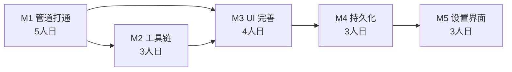

# BiliGo 里程碑计划

## 文档概述

本文档定义 BiliGo 从自写 llm-provider 迁移到 Vercel AI SDK 架构的 5 个里程碑（M1-M5），每个里程碑包含核心目标、依赖关系、详细任务列表、验收标准、风险点和预计工时。

## 里程碑总览

```
M1 管道打通          M2 工具链集成       M3 UI 完善          M4 持久化          M5 设置界面
(L0-L4)              (L5)                (L6)                (L7)               (L8)
┌──────────┐       ┌──────────┐       ┌──────────┐       ┌──────────┐       ┌──────────┐
│ 单Provider│──────>│ Tool     │──────>│ 完整对话 │──────>│ 历史保存 │──────>│ API Key  │
│ 流式可用  │       │ Calling  │       │ 界面    │       │ 配置持久 │       │ 配置界面 │
└──────────┘       └──────────┘       └──────────┘       └──────────┘       └──────────┘
  约 5 天              约 3 天             约 4 天             约 3 天             约 3 天
```

| 里程碑 | 核心目标 | 依赖 | 预计工时 | 状态 |
|--------|---------|------|---------|------|
| M1 | CS 通过 SW 调用 OpenAI 显示流式响应 | 无 | 5 人日 | 🔄 待开始 |
| M2 | Tool Calling 可用（搜索 B 站视频） | M1 | 3 人日 | 🔄 待开始 |
| M3 | 完整的对话界面（消息渲染 + 输入） | M1, M2 | 4 人日 | 🔄 待开始 |
| M4 | 对话历史和配置持久化 | M3 | 3 人日 | 🔄 待开始 |
| M5 | 用户可配置 9 个 Provider 的 API Keys | M4 | 3 人日 | 🔄 待开始 |

**总计**: 约 18 人日

---

## M1: 管道打通（L0-L4）

### 核心目标
实现 Content Script 通过 Port 向 Service Worker 发送聊天请求，SW 调用 Vercel AI SDK 的 `streamText` 连接 OpenAI API，并将流式响应分块传回 CS 显示。**M1 完成后，用户可在 B 站页面看到一个最简面板，输入文字并看到 AI 流式回复。**

### 依赖的里程碑
无（首个里程碑）

### 前置验证（M1 开始前必做）
> 对应风险 R6: 验证 Vercel AI SDK 在 SW 环境的兼容性

### 详细任务列表

| # | 任务 | 层级 | 状态 | 说明 |
|---|------|------|------|------|
| 1.1 | 验证 AI SDK 在 SW 中的兼容性 | L4 | 🔄 | 写最小脚本调用 streamText，确认无 Buffer/window 报错 |
| 1.2 | 补全 manifest.json 的 host_permissions | L0 | 🔄 | 添加 9 个 Provider 域名（对应 R2） |
| 1.3 | 创建 src/shared/ 目录结构 | L1 | 🔄 | port-messages.ts、provider-config.ts、index.ts |
| 1.4 | 定义 Port 消息协议类型 | L1 | 🔄 | PortMessage、ChatRequest、ChunkPayload 等类型 |
| 1.5 | 定义 ProviderConfig 类型 | L1 | 🔄 | 9 个 Provider 配置结构 + DEFAULT_MODELS |
| 1.6 | 实现 bilibili-client 基础结构 | L1 | 🔄 | client.ts 骨架（searchVideos/getVideoInfo 暂留空） |
| 1.7 | 实现 SW 入口与 Port 监听 | L2-SW | 🔄 | 改造 background/index.ts，注册 onConnect/onMessage |
| 1.8 | 实现 chat-handler（调用 streamText） | L2-SW | 🔄 | 消费 fullStream，发送 chunk/done/error |
| 1.9 | 实现 StreamChunker（分块器） | L3 | 🔄 | seq 递增，可选批量发送（对应 R3） |
| 1.10 | 实现 port-keepalive（心跳保活） | L3 | 🔄 | 25s ping/pong（对应 R1） |
| 1.11 | 实现 Provider 工厂（仅 OpenAI） | L4 | 🔄 | getProvider() 支持 openai 分支 |
| 1.12 | 实现 CS 入口与 Port 客户端 | L2-CS | 🔄 | 改造 content/index.tsx，建立 Port 连接 |
| 1.13 | 实现 ChunkReassembler（去块器） | L3 | 🔄 | 按 seq 重组，检测丢块 |
| 1.14 | 实现最简 Chat UI（输入框+文本显示） | L6 | 🔄 | 无样式，仅验证数据流通 |
| 1.15 | 端到端联调验证 | 全层 | 🔄 | 输入"你好"，看到流式回复 |

### 验收标准

- [ ] 在 B 站任意页面，扩展能注入一个面板
- [ ] 面板有输入框，输入文字点击发送
- [ ] 5 秒内开始看到 AI 流式回复（逐字出现）
- [ ] 流式回复完整，无丢字、乱序
- [ ] 响应超过 30 秒时连接不中断（R1 验证）
- [ ] Chrome 控制台无 CORS / CSP 错误
- [ ] OpenAI API Key 通过临时硬编码测试（M5 再做配置界面）

### 风险点
- **R6（高）**: AI SDK 在 SW 中可能不兼容 → 任务 1.1 优先验证，不通过则评估 polyfill 或换方案
- **R1（高）**: SW 休眠 → 任务 1.10 实现心跳保活
- **R2（高）**: host_permissions 缺失 → 任务 1.2 补全
- **R3（中）**: 流式丢块 → 任务 1.9/1.13 实现 seq 机制

### 预计工时: 5 人日

---

## M2: 工具链集成（L5）

### 核心目标
实现 Tool Calling 功能，使 AI 能调用 `searchBilibiliVideos` 和 `getVideoInfo` 工具搜索 B 站视频，并在 UI 中显示工具调用过程和结果。

### 依赖的里程碑
M1（需要 M1 的管道和 Provider 已就绪）

### 详细任务列表

| # | 任务 | 层级 | 状态 | 说明 |
|---|------|------|------|------|
| 2.1 | 完善 bilibili-client 的 searchVideos | L1 | 🔄 | 实现 B 站搜索 API 调用，含 cookie/Referer |
| 2.2 | 完善 bilibili-client 的 getVideoInfo | L1 | 🔄 | 实现视频详情 API 调用 |
| 2.3 | 定义 Bilibili API 响应类型 | L1 | 🔄 | SearchResult、VideoInfo 等类型 |
| 2.4 | 定义 Zod Schema | L5 | 🔄 | searchBilibiliVideosSchema、getVideoInfoSchema |
| 2.5 | 实现 searchBilibiliVideos 工具 | L5 | 🔄 | 使用 AI SDK 的 tool() 包装 |
| 2.6 | 实现 getVideoInfo 工具 | L5 | 🔄 | 使用 AI SDK 的 tool() 包装 |
| 2.7 | 实现工具注册表 | L5 | 🔄 | getTools(names) 按名获取子集 |
| 2.8 | 改造 chat-handler 支持工具调用 | L2-SW | 🔄 | streamText 传入 tools，处理 tool-call/result 事件 |
| 2.9 | 扩展 Port 消息协议 | L3 | 🔄 | 新增 tool-call-start、tool-call-result 消息类型 |
| 2.10 | CS 端处理工具调用消息 | L2-CS | 🔄 | ChatState 新增 tool-calling 状态 |
| 2.11 | UI 显示工具调用状态 | L6 | 🔄 | 显示"正在搜索 B 站视频..." |
| 2.12 | UI 渲染工具结果（视频卡片） | L6 | 🔄 | 简单列表展示，M3 再美化 |
| 2.13 | 端到端验证 Tool Calling | 全层 | 🔄 | 输入"搜索 Python 教程"，看到视频列表 |

### 验收标准

- [ ] 输入"搜索 Python 教程"，AI 调用 searchBilibiliVideos 工具
- [ ] UI 显示"正在搜索..."状态
- [ ] 工具执行后，UI 显示视频列表（标题、UP主、播放量）
- [ ] AI 基于搜索结果生成自然语言总结
- [ ] 输入"看看第一个视频的详情"，AI 调用 getVideoInfo
- [ ] 多轮工具调用正常（搜索→详情→总结）

### 风险点
- **R9（中）**: B 站反爬 → 限流 1 秒/次
- **R12（中）**: OpenAI 模型工具调用兼容性 → M2 仅验证 OpenAI，其他 Provider 在 M5 验证

### 预计工时: 3 人日

---

## M3: UI 完善（L6）

### 核心目标
实现完整的对话界面，包括消息列表渲染、流式打字效果、Markdown 渲染、视频卡片美化、错误提示等。

### 依赖的里程碑
M1, M2（需要数据流和工具链已就绪）

### 详细任务列表

| # | 任务 | 层级 | 状态 | 说明 |
|---|------|------|------|------|
| 3.1 | 设计 Chat UI 组件树 | L6 | 🔄 | App → MessageList → Message + VideoCard |
| 3.2 | 实现 chat-store 状态管理 | L6 | 🔄 | 维护 ChatState，驱动渲染 |
| 3.3 | 实现 MessageList 组件 | L6 | 🔄 | 渲染用户/助手消息，区分样式 |
| 3.4 | 实现 MessageInput 组件 | L6 | 🔄 | 文本输入，Enter 发送，Shift+Enter 换行 |
| 3.5 | 实现流式打字效果 | L6 | 🔄 | chunk 到达时逐字追加 + 光标动画 |
| 3.6 | 实现 Markdown 渲染 | L6 | 🔄 | 助手消息支持 Markdown（代码块、列表、链接） |
| 3.7 | 实现 VideoCard 组件 | L6 | 🔄 | 视频卡片：封面、标题、UP主、播放量 |
| 3.8 | 实现 TypingIndicator | L6 | 🔄 | 三点动画，流式响应时显示 |
| 3.9 | 实现错误提示组件 | L6 | 🔄 | 显示错误码 + 消息 + 重试按钮 |
| 3.10 | 实现 Shadow DOM 样式隔离 | L6 | 🔄 | CSS Reset，避免 B 站样式污染（R11） |
| 3.11 | 实现面板展开/收起 | L6 | 🔄 | 侧边栏样式，可拖拽 |
| 3.12 | 实现消息滚动到底部 | L6 | 🔄 | 新消息到达时自动滚动 |
| 3.13 | 响应式适配 | L6 | 🔄 | 不同页面宽度下面板自适应 |
| 3.14 | UI 性能优化 | L6 | 🔄 | requestAnimationFrame 批量更新（R10） |
| 3.15 | 视觉设计打磨 | L6 | 🔄 | 配色、间距、字体统一 |

### 验收标准

- [ ] 对话界面美观，与 B 站页面视觉协调
- [ ] 流式响应有逐字打字效果
- [ ] 助手消息支持 Markdown（代码高亮、列表）
- [ ] 视频卡片显示封面、标题、UP主、播放量
- [ ] 错误时有明确提示和重试按钮
- [ ] 面板可展开/收起，不遮挡 B 站主要内容
- [ ] Shadow DOM 内样式不受 B 站影响
- [ ] 流式输出 FPS >= 30（R10 验证）

### 风险点
- **R10（低）**: UI 渲染性能 → 任务 3.14 批量更新
- **R11（低）**: Shadow DOM 样式冲突 → 任务 3.10 CSS Reset

### 预计工时: 4 人日

---

## M4: 持久化（L7）

### 核心目标
实现对话历史和用户配置的持久化存储，刷新页面后对话不丢失，API Key 加密存储。

### 依赖的里程碑
M3（需要 UI 完成以显示历史）

### 详细任务列表

| # | 任务 | 层级 | 状态 | 说明 |
|---|------|------|------|------|
| 4.1 | 定义 Storage Schema | L7 | 🔄 | SettingsStorage、HistoryStorage 类型 |
| 4.2 | 实现 storage/keys.ts | L7 | 🔄 | 统一 key 常量 |
| 4.3 | 实现 API Key 加密/解密 | L7 | 🔄 | AES-256-GCM，Web Crypto API（R5） |
| 4.4 | 实现 settings 存储读写 | L7 | 🔄 | chrome.storage.sync 读写用户设置 |
| 4.5 | 实现 history 存储读写 | L7 | 🔄 | chrome.storage.local 读写对话历史 |
| 4.6 | 实现对话历史保存 | L7 | 🔄 | 每次对话完成后自动保存 |
| 4.7 | 实现对话历史加载 | L7 | 🔄 | 页面加载时恢复最近对话 |
| 4.8 | 实现历史对话列表 | L6 | 🔄 | UI 显示历史对话，可切换 |
| 4.9 | 实现新建对话 | L6 | 🔄 | 清空当前，创建新对话 |
| 4.10 | 实现删除对话 | L6 | 🔄 | 从历史中删除指定对话 |
| 4.11 | 实现对话截断策略 | L4 | 🔄 | 长对话自动截断（R8） |
| 4.12 | 端到端验证持久化 | 全层 | 🔄 | 刷新页面后对话和配置都在 |

### 验收标准

- [ ] 对话完成后自动保存到 chrome.storage.local
- [ ] 刷新 B 站页面后，历史对话恢复
- [ ] 可查看历史对话列表并切换
- [ ] 可新建和删除对话
- [ ] API Key 加密存储（chrome.storage 中无明文）
- [ ] 历史对话超过 50 条时自动清理最旧的
- [ ] 长对话发送前自动截断（R8 验证）

### 风险点
- **R5（高）**: API Key 泄露 → 任务 4.3 加密存储
- **R8（中）**: Token 溢出 → 任务 4.11 截断策略

### 预计工时: 3 人日

---

## M5: 设置界面（L8）

### 核心目标
实现 Options Page，用户可配置 9 个 Provider 的 API Keys、选择默认模型、设置启用的工具。

### 依赖的里程碑
M4（需要持久化层存储配置）

### 详细任务列表

| # | 任务 | 层级 | 状态 | 说明 |
|---|------|------|------|------|
| 5.1 | 创建 Options Page HTML | L8 | 🔄 | options/index.html |
| 5.2 | 实现 OptionsApp 根组件 | L8 | 🔄 | 设置界面布局 |
| 5.3 | 实现 ProviderForm 组件 | L8 | 🔄 | 通用表单：API Key、模型选择、baseURL |
| 5.4 | 实现 9 个 Provider 配置表单 | L8 | 🔄 | 每个 Provider 一个表单实例 |
| 5.5 | 实现模型选择下拉 | L8 | 🔄 | 按 Provider 显示可选模型列表 |
| 5.6 | 实现默认 Provider 选择 | L8 | 🔄 | 选择当前激活的 Provider |
| 5.7 | 实现工具启用/禁用 | L8 | 🔄 | 勾选框选择启用的工具 |
| 5.8 | 实现系统提示词编辑 | L8 | 🔄 | 可自定义 system prompt |
| 5.9 | 实现主题切换 | L8 | 🔄 | light/dark/auto |
| 5.10 | 实现 API Key 连接测试 | L8 | 🔄 | 配置后可一键测试 API 连通性 |
| 5.11 | 验证 9 个 Provider 可用性 | L4 | 🔄 | 每个 Provider 至少完成一次调用（R2 验证） |
| 5.12 | 实现 Provider 能力声明 | L4 | 🔄 | 标注哪些 Provider 支持工具调用（R12） |
| 5.13 | 实现不支持工具的降级提示 | L6 | 🔄 | 选择不支持工具的模型时禁用工具 |
| 5.14 | manifest.json 注册 options_page | L0 | 🔄 | 添加 options_page 配置 |
| 5.15 | 设置界面视觉打磨 | L8 | 🔄 | 配色、布局、交互细节 |

### 验收标准

- [ ] Options Page 可通过扩展菜单打开
- [ ] 可配置全部 9 个 Provider 的 API Key
- [ ] API Key 输入框为 password 类型
- [ ] 可选择每个 Provider 的模型
- [ ] 可设置默认 Provider
- [ ] 可启用/禁用工具
- [ ] 配置保存后，立即在对话中生效
- [ ] 9 个 Provider 均能成功调用（R2 最终验证）
- [ ] 不支持工具的 Provider 有明确提示（R12 验证）
- [ ] API Key 测试按钮可验证连通性

### 风险点
- **R2（高）**: host_permissions → 已在 M1 补全，M5 最终验证全部 9 个
- **R12（中）**: 模型能力差异 → 任务 5.12/5.13 声明并降级
- **R4（中）**: 跨域阻止 → M5 验证全部 9 个 Provider 跨域调用

### 预计工时: 3 人日

---

## 里程碑依赖关系



## 风险与里程碑映射

| 风险 | 严重度 | 关联里程碑 | 验收节点 |
|------|--------|-----------|---------|
| R1 SW 休眠 | 高 | M1 | 任务 1.10 |
| R2 host_permissions | 高 | M1（补全）/ M5（全验证） | 任务 1.2 / 5.11 |
| R3 流式丢块 | 中 | M1 | 任务 1.9, 1.13 |
| R4 跨域阻止 | 中 | M5 | 任务 5.11 |
| R5 API Key 泄露 | 高 | M4 | 任务 4.3 |
| R6 SDK 兼容性 | 中 | M1 | 任务 1.1 |
| R7 CSP 限制 | 中 | M1 | 构建验证 |
| R8 Token 溢出 | 中 | M4 | 任务 4.11 |
| R9 B 站反爬 | 中 | M2 | 任务 2.1 |
| R10 UI 性能 | 低 | M3 | 任务 3.14 |
| R11 样式冲突 | 低 | M3 | 任务 3.10 |
| R12 模型差异 | 中 | M5 | 任务 5.12 |

## 进度跟踪

### 状态说明
- 🔄 待做: 尚未开始
- ⏳ 进行中: 正在开发
- ✅ 完成: 已完成并验证

### 更新规则
- 每日更新任务状态
- 每完成一个里程碑，更新总览表
- 风险状态变化时同步更新《风险评估.md》

## 总验收标准（全部里程碑完成后）

- [ ] 9 个 Provider 均可正常对话
- [ ] 流式响应流畅，无丢字乱序
- [ ] Tool Calling 可用，能搜索 B 站视频
- [ ] UI 美观，与 B 站页面协调
- [ ] 对话历史持久化，刷新不丢失
- [ ] API Key 加密存储
- [ ] 设置界面完整可用
- [ ] Chrome 控制台无错误
- [ ] 性能达标（流式 FPS >= 30）
- [ ] 通过 Chrome Web Store 审核准备（权限声明合理）
