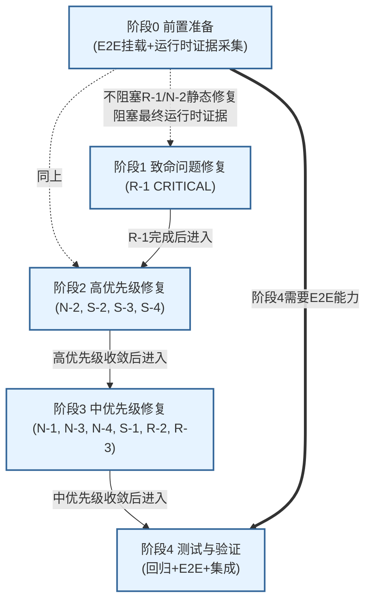
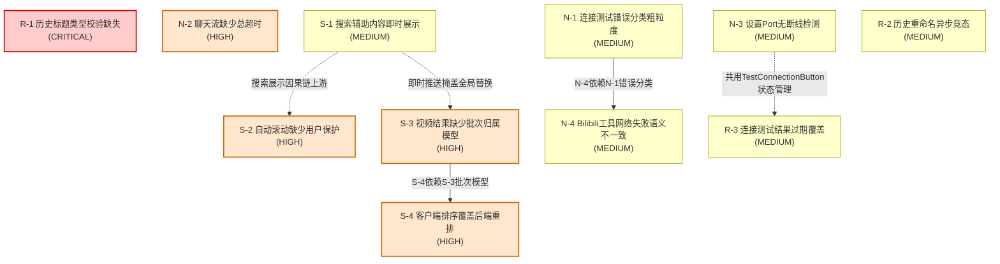

# BiliGO BugFix 修复方案

## 简介

本目录是 `docs/问题档案/` 的执行侧镜像，负责按优先级和依赖关系把已确认的代码问题安排成可落地的多阶段修复计划。问题档案按技术域保存调查结论和静态证据，修复方案按执行批次组织实施顺序、依赖关系、测试策略和验收标准。两套文档通过问题编号互相链接，互不替代。

## 与问题档案的关系

| 维度 | `docs/问题档案/` | `docs/修复方案/`（本目录） |
| --- | --- | --- |
| 组织维度 | 按技术域分类（网络、状态、UI、排序、测试、假设） | 按执行阶段排序（阶段0到阶段4） |
| 内容性质 | 调查结论、代码证据、复现要求、待验证假设 | 实施步骤、依赖关系、测试策略、验收标准 |
| 修改对象 | 不修改源码，只记录问题 | 不修改源码，只描述修复计划 |
| 引用方向 | 本目录通过问题编号和相对路径链接回问题档案 | 问题档案不反向引用本目录 |
| 使用场景 | 按领域检索问题、分析共性特征 | 按批次安排实施、跟踪修复状态 |

修复任一问题时，应同时参阅本目录的阶段方案和 `docs/问题档案/` 对应分类的 README 与原始问题文档，确保不遗漏原始调查中记录的复现证据要求和边界条件。

## 已确认问题总览

问题档案共收录 11 个已确认的代码问题（注：档案 README 声称 12 项，但实际问题档案中不存在 R-4，按编号实际为 N-1 到 N-4、S-1 到 S-4、R-1 到 R-3 共 11 项），按严重程度分布如下：

| 严重程度 | 数量 | 问题编号 |
| --- | --- | --- |
| CRITICAL | 1 | R-1 |
| HIGH | 4 | N-2、S-2、S-3、S-4 |
| MEDIUM | 6 | N-1、N-3、N-4、S-1、R-2、R-3 |

说明：问题档案 README 中"按严重程度统计 HIGH 5 项、共 12 项"的表述与实际收录的问题清单不一致。实际收录的问题关联图（`docs/问题档案/问题关联图.md`）中仅定义 11 个节点，不存在 R-4。本目录以实际存在的问题编号为准，不引用不存在的 R-4。

## 阶段路线图

修复工作按 5 个阶段递进执行。每个阶段都有明确的目标、前置依赖和退出条件。

| 阶段 | 名称 | 目标 | 包含问题 | 前置依赖 |
| --- | --- | --- | --- | --- |
| 阶段0 | 前置准备 | 恢复 E2E 验证能力、采集运行时证据的基础设施 | 无具体问题编号，对应测试覆盖缺口与 E2E 运行阻塞 | 无 |
| 阶段1 | 致命问题修复 | 消除已确认的渲染崩溃入口 | R-1（CRITICAL） | 阶段0 不阻塞本阶段静态修复 |
| 阶段2 | 高优先级修复 | 处理核心可用性与数据正确性问题 | N-2、S-2、S-3、S-4（HIGH） | R-1 完成；S-4 依赖 S-3 |
| 阶段3 | 中优先级修复 | 收敛体验和诊断能力问题 | N-1、N-3、N-4、S-1、R-2、R-3（MEDIUM） | N-4 依赖 N-1；N-3 与 R-3 共用状态管理 |
| 阶段4 | 测试与验证 | 补齐回归验证、E2E 场景和跨域集成 | 对应测试覆盖缺口清单与 E2E 回归 | 阶段1到阶段3的修复基本完成 |

## 阶段依赖 Mermaid 图



## 问题内部依赖 Mermaid 图

下图展示 11 个已确认问题之间的修复依赖关系。实线箭头表示强执行依赖（前置必须先完成），虚线箭头表示共用代码或问题域关联（需协调修复但不构成硬阻塞）。



依赖关系说明：

1. **S-4 依赖 S-3**：S-3 完成视频结果的批次归属模型（`searchId`/`batchId`/`messageId`）后，S-4 才能在批次模型基础上定义最终排序行为。若先修 S-4，排序逻辑没有批次锚点可挂载，会导致排序重置和覆盖行为无法稳定收敛。
2. **N-4 依赖 N-1**：N-1 先定义统一的网络错误分类语义（区分 DNS 错误、TLS 错误、HTTP 状态码错误、超时和 Provider 配置错误），N-4 才能把 Bilibili 工具网络失败接入统一语义层。若先修 N-4，工具调用路径缺少统一分类基础，仍会与连接测试文案语义不一致。
3. **N-3 与 R-3 共用状态管理**：两者共同涉及 `Main/src/components/model-settings/TestConnectionButton.tsx` 的状态管理逻辑。N-3 关注 Port 断线检测能力缺失，R-3 关注异步 Promise 完成时机晚于视图切换。修复时应统一检查 listener、timer、取消和过期结果，避免分别修改造成二次竞态。
4. **S-1 到 S-4 因果链**：搜索结果展示的四个问题形成逐级传导的因果链（即时展示 → 无条件滚动 → 全局替换 → 排序覆盖）。修复时应从 S-1 的推送时机和 S-3 的数据模型入手，而非仅修补末端的排序覆盖。

## 问题编号到方案文件索引

下表列出每个问题对应的修复阶段、阶段方案文件相对路径和问题档案相对路径。

| 问题编号 | 严重程度 | 修复阶段 | 阶段方案文件 | 问题档案分类 | 问题档案文件 |
| --- | --- | --- | --- | --- | --- |
| R-1 | CRITICAL | 阶段1 | `阶段1-致命问题修复/R-1-历史标题类型校验修复方案.md` | 02-状态管理与数据生命周期 | `docs/问题档案/02-状态管理与数据生命周期/R-1-历史标题类型校验缺失.md` |
| N-2 | HIGH | 阶段2 | `阶段2-高优先级修复/2.2-网络超时/N-2-聊天流总超时修复方案.md` | 01-网络与超时控制 | `docs/问题档案/01-网络与超时控制/N-2-聊天流缺少总超时.md` |
| S-2 | HIGH | 阶段2 | `阶段2-高优先级修复/2.3-UI交互保护/S-2-自动滚动保护修复方案.md` | 03-UI渲染与交互 | `docs/问题档案/03-UI渲染与交互/S-2-自动滚动缺少用户保护.md` |
| S-3 | HIGH | 阶段2 | `阶段2-高优先级修复/2.1-搜索结果生命周期/S-3-视频批次归属模型修复方案.md` | 02-状态管理与数据生命周期 | `docs/问题档案/02-状态管理与数据生命周期/S-3-视频结果缺少批次归属模型.md` |
| S-4 | HIGH | 阶段2 | `阶段2-高优先级修复/2.1-搜索结果生命周期/S-4-客户端排序覆盖修复方案.md` | 04-排序与重排逻辑 | `docs/问题档案/04-排序与重排逻辑/S-4-客户端排序覆盖后端重排.md` |
| N-1 | MEDIUM | 阶段3 | `阶段3-中优先级修复/N-1-连接测试错误分类修复方案.md` | 01-网络与超时控制 | `docs/问题档案/01-网络与超时控制/N-1-连接测试错误分类粗粒度.md` |
| N-3 | MEDIUM | 阶段3 | `阶段3-中优先级修复/N-3-设置Port断线检测修复方案.md` | 01-网络与超时控制 | `docs/问题档案/01-网络与超时控制/N-3-设置Port无断线检测.md` |
| N-4 | MEDIUM | 阶段3 | `阶段3-中优先级修复/N-4-Bilibili网络失败语义修复方案.md` | 01-网络与超时控制 | `docs/问题档案/01-网络与超时控制/N-4-Bilibili工具网络失败语义不一致.md` |
| S-1 | MEDIUM | 阶段3 | `阶段3-中优先级修复/S-1-搜索辅助内容展示时机修复方案.md` | 03-UI渲染与交互 | `docs/问题档案/03-UI渲染与交互/S-1-搜索辅助内容即时展示.md` |
| R-2 | MEDIUM | 阶段3 | `阶段3-中优先级修复/R-2-历史重命名竞态修复方案.md` | 02-状态管理与数据生命周期 | `docs/问题档案/02-状态管理与数据生命周期/R-2-历史重命名异步竞态.md` |
| R-3 | MEDIUM | 阶段3 | `阶段3-中优先级修复/R-3-连接测试结果过期修复方案.md` | 02-状态管理与数据生命周期 | `docs/问题档案/02-状态管理与数据生命周期/R-3-连接测试结果过期覆盖.md` |

测试与验证相关工作不对应具体问题编号，归入阶段0和阶段4：

| 工作类别 | 修复阶段 | 阶段方案文件 | 问题档案参考 |
| --- | --- | --- | --- |
| E2E 运行阻塞解除 | 阶段0 | `阶段0-前置准备/README.md` | `docs/问题档案/05-测试与验证缺口/E2E运行阻塞问题.md` |
| 测试覆盖缺口补齐 | 阶段4 | `阶段4-测试与验证/README.md` | `docs/问题档案/05-测试与验证缺口/测试覆盖缺口清单.md` |

## 目录结构

```
docs/修复方案/
├── README.md                          # 本文件，总索引与路线图
├── 修复状态追踪.md                    # 修复状态定义、状态表、阻塞关系、退出条件
├── 阶段0-前置准备/
│   ├── README.md                     # E2E挂载阻塞、运行时证据采集
│   └── E2E测试环境修复方案.md
├── 阶段1-致命问题修复/
│   ├── README.md                     # R-1
│   └── R-1-历史标题类型校验修复方案.md
├── 阶段2-高优先级修复/
│   ├── README.md                     # N-2, S-2, S-3, S-4
│   ├── 2.1-搜索结果生命周期/
│   │   ├── S-3-视频批次归属模型修复方案.md
│   │   └── S-4-客户端排序覆盖修复方案.md
│   ├── 2.2-网络超时/N-2-聊天流总超时修复方案.md
│   └── 2.3-UI交互保护/S-2-自动滚动保护修复方案.md
├── 阶段3-中优先级修复/
│   ├── README.md                     # N-1, N-3, N-4, S-1, R-2, R-3
│   ├── N-1-连接测试错误分类修复方案.md
│   ├── N-3-设置Port断线检测修复方案.md
│   ├── N-4-Bilibili网络失败语义修复方案.md
│   ├── S-1-搜索辅助内容展示时机修复方案.md
│   ├── R-2-历史重命名竞态修复方案.md
│   └── R-3-连接测试结果过期修复方案.md
└── 阶段4-测试与验证/
    ├── README.md                     # 测试覆盖缺口、E2E场景回归、跨域集成验证
    ├── 测试覆盖缺口补齐方案.md
    ├── E2E场景回归方案.md
    └── 跨域集成验证方案.md
```

## 文档约定

- 本目录只描述修复计划，不记录已完成的修复或已验证的结论。
- 运行时验证只记录采集要求，不把尚未验证的现象写成已确认根因。
- 所有方案通过问题编号链接回 `docs/问题档案/`，不复制原始调查的完整叙述。
- 修复状态以 `修复状态追踪.md` 为准，阶段 README 不维护状态字段。
