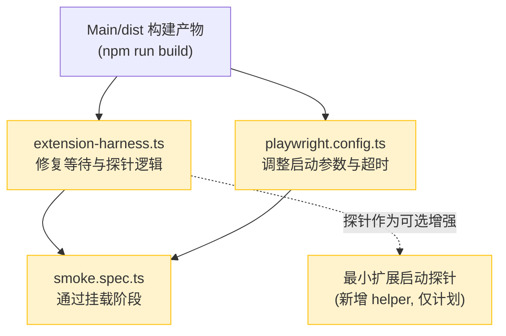
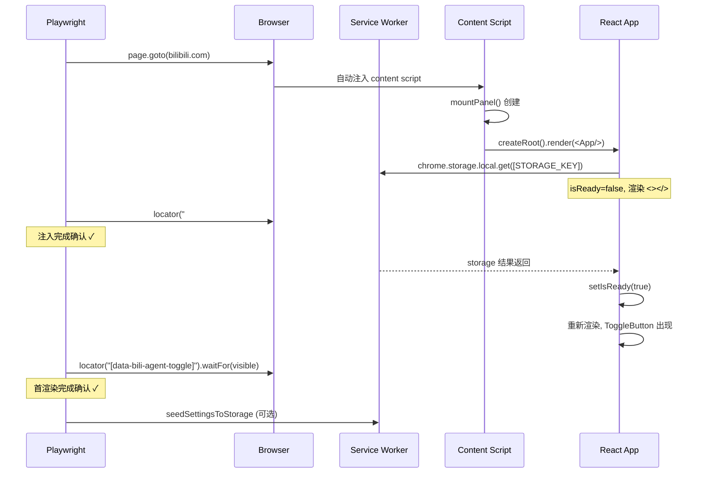

# E2E 测试环境修复方案

> **阶段归属**：阶段0 前置准备 · 方案一：E2E 运行阻塞解除
> **对应问题档案**：`docs/问题档案/05-测试与验证缺口/E2E运行阻塞问题.md`
> **来源记录**：`docs/渲染崩溃问题记录.md`
> **关联假设**：`docs/问题档案/06-待验证假设/搜索结果高风险假设清单.md`（S-V5 service worker 消息到达间隔）
> **完成状态**：pending

## 1. 问题定位

### 1.1 现象

现有 Playwright E2E 在 content script 挂载验证阶段失败，未执行任何目标按钮点击，因此没有获得用户现象对应的浏览器崩溃堆栈。失败点位于 `Main/e2e/fixtures/extension-harness.ts:85-87`：

```ts
await page
  .locator("[data-bili-agent-toggle]")
  .waitFor({ state: "visible", timeout: csTimeout });
```

诊断文件 `Main/test-results/smoke-BiliGo-panel-UX-no-b-a381c-e-edge-and-expands-on-hover-chromium-extension/error-context.md:15-23` 记录的错误为：

```text
Error: Channel closed
Error: page.goto: Target page, context or browser has been closed
Error: browserContext.close: Target page, context or browser has been closed
```

### 1.2 错误语义拆解

三条错误叠加出现，对应不同层级失效：

| 错误 | 失效层级 | 含义 |
| --- | --- | --- |
| `Channel closed` | Playwright ↔ Chromium 进程通信通道 | 浏览器进程与 Playwright 之间的通信通道断开，通常是浏览器进程已被销毁或崩溃 |
| `page.goto: Target page, context or browser has been closed` | Page 对象层 | 页面层已失效，goto 无法执行 |
| `browserContext.close: ...` | BrowserContext 层 | context 关闭时再次报错，确认整个浏览器实例已不可用 |

关键判断：失败发生在 harness 等待选择器阶段，没有进入任何导航或点击动作，因此可以排除"点击导致崩溃"的可能。

### 1.3 根因边界（已确认与待验证）

依据 `docs/渲染崩溃问题记录.md` 的记录原则——不把未经运行时确认的假设写成根因，本方案明确区分已确认边界与待验证假设：

**已确认的边界（静态代码审查得出）：**

1. `Channel closed` 是浏览器实例失效的**表现**，不是根因本身。当前没有运行时证据证明它是"直接浏览器根因"。
2. harness 的等待逻辑本身没有语法错误：选择器 `[data-bili-agent-toggle]` 正确，Playwright 默认穿透 open Shadow DOM（`Main/src/content/index.tsx:25` 用 `mode: 'open'` 挂载 Shadow DOM），选择器可达。
3. content script 匹配规则 `*://*.bilibili.com/*`（`Main/manifest.json:14`）要求导航到 bilibili 域名才会触发自动注入，`extension-harness.ts` 默认导航 `https://www.bilibili.com` 符合匹配规则。
4. 即使 content script 已挂载，`[data-bili-agent-toggle]` 也不会立即出现：`Main/src/components/App.tsx:85-87` 在 `isReady` 为 false 时渲染 `<></>`，而 `isReady` 依赖 `chrome.storage.local.get` 的 Promise 解析（`App.tsx:15-26`）。因此 harness 的等待超时（默认 10 秒）可能不足以覆盖 storage 读取 + 首次渲染完成。

**待验证的根因假设（需运行时证据确认，不得写成已确认根因）：**

| 编号 | 假设 | 验证方式 |
| --- | --- | --- |
| E0-A1 | 浏览器进程在导航后崩溃（如扩展初始化触发 V8 异常） | 捕获 `browser.on('disconnected')` 事件 + stderr 输出 |
| E0-A2 | service worker 启动失败或被提前回收，导致 content script 注入后无法完成 storage 读取 | 检查 `chrome://extensions` 的 SW 状态 + SW 控制台错误 |
| E0-A3 | bilibili 首页 CSP 或反爬机制阻止 content script 注入 | 检查页面控制台是否有 CSP 违规报告 |
| E0-A4 | Playwright `--load-extension` 在当前 Chromium 版本下加载失败 | `context.on('webextension', ...)` 监听 + 检查 `chrome://extensions` |
| E0-A5 | harness 等待超时不足（10 秒），storage 读取 + 首渲染超出窗口 | 延长超时并加入分阶段探针 |
| E0-A6 | 网络环境导致 `https://www.bilibili.com` 导航超时，触发 Playwright 内部清理逻辑关闭浏览器 | 检查 `page.goto` 是否因网络超时失败 |

## 2. 已确认与待验证边界

### 2.1 已确认的边界

| 边界项 | 依据 |
| --- | --- |
| 失败发生在等待选择器阶段，未进入点击交互 | `error-context.md` 记录的失败位置是 `extension-harness.ts:85-87` 的 waitFor |
| `[data-bili-agent-toggle]` 选择器正确且 Shadow DOM 可穿透 | `Main/src/components/ToggleButton.tsx:157` 有 `data-bili-agent-toggle` 属性；`content/index.tsx:25` 用 `mode: 'open'` |
| content script 匹配规则要求 bilibili 域名 | `manifest.json:14` 的 `matches: ["*://*.bilibili.com/*"]` |
| toggle 按钮在 `isReady=false` 时不渲染 | `App.tsx:85-87` 渲染 `<></>`，`isReady` 依赖 storage 读取 |
| `Channel closed` 是浏览器失效的表现，非根因 | `docs/渲染崩溃问题记录.md:133` 明确"不能等同于用户描述的按钮渲染崩溃" |

### 2.2 待验证的边界

| 边界项 | 当前状态 |
| --- | --- |
| 浏览器进程是否在导航后崩溃（E0-A1） | 待验证 |
| service worker 是否成功启动并响应 storage 请求（E0-A2） | 待验证 |
| bilibili 页面 CSP 是否阻止注入（E0-A3） | 待验证 |
| `--load-extension` 是否实际加载成功（E0-A4） | 待验证 |
| 10 秒等待超时是否足够（E0-A5） | 待验证 |
| 导航是否因网络问题超时（E0-A6） | 待验证 |

### 2.3 不阻塞静态修复的声明

依据 `docs/修复方案/修复状态追踪.md:63-69` 的 E2E 阻塞特殊规则：

- **阶段0 不阻塞 R-1 / N-2 的静态修复**：R-1（历史标题类型校验）和 N-2（聊天流总超时）已由静态代码证据确认根因，其修复方案设计、代码实现和单元测试可以在 E2E 能力恢复之前并行推进。
- **阶段0 阻塞最终 E2E 证据采集**：R-1、R-2、R-3 的渲染崩溃堆栈、S-2 的实际滚动频率、S-4 的最终 DOM 顺序、N-V1 到 N-V6 和 S-V1 到 S-V5 的假设验证，都需要运行时证据支持，必须等待本方案恢复 E2E 能力后才能采集。
- 因此阶段1 到阶段3 的代码修复可以先行推进，但其 `completed` 状态的最终验收需要本方案提供的运行时证据支持。

## 3. 修复目标

| 目标编号 | 目标 | 验收方式 |
| --- | --- | --- |
| G1 | 消除 `Channel closed` 和 `page.goto: Target page, context or browser has been closed` 错误 | smoke 测试不再报这两条错误 |
| G2 | harness 能稳定等待 content script 挂载，`[data-bili-agent-toggle]` 在限定时间内出现 | smoke 测试通过 waitFor 阶段 |
| G3 | 至少一条目标 smoke 测试能进入面板打开和按钮交互阶段 | smoke 测试执行到 `openPanel` 并断言面板可见 |
| G4 | 运行时证据采集通道可用（控制台日志、DOM 状态、SW 状态） | 采集通道能记录非敏感信息 |
| G5 | content script 和 service worker 就绪判断可观测 | harness 能区分"未注入"与"已注入未就绪" |

## 4. 依赖关系



### 4.1 前置依赖

- `Main/dist` 必须存在且是最新构建（`npm run build` 产物）。`playwright.config.ts:9` 的 `extensionPath` 指向 `dist/`，若不存在则 `--load-extension` 无效。
- Playwright 浏览器已安装（`npx playwright install chromium`）。`docs/渲染崩溃问题记录.md:116` 记录测试代理曾安装缺失的 Chromium。

### 4.2 不阻塞的关系

- 本方案**不依赖** R-1、N-2 等业务修复完成。E2E 环境修复是基础设施工作，与业务代码修复解耦。
- 本方案**不阻塞** R-1、N-2 的静态修复推进，只阻塞它们的最终运行时验证。

## 5. 修改文件

### 5.1 必须修改的文件

| 文件 | 修改内容 | 行号范围 |
| --- | --- | --- |
| `Main/e2e/fixtures/extension-harness.ts` | 修复等待逻辑：增加分阶段探针、区分未注入与未就绪、延长超时、增加错误证据采集 | `85-87`（核心等待点）及周边 `67-108`（`openBilibiliWithMockedExtension` 函数体） |
| `Main/playwright.config.ts` | 调整 launchOptions：增加 `--enable-automation` 等稳定化参数、调整默认超时 | `24-41`（projects 配置） |

### 5.2 计划新增但不实际创建的文件（helper，仅作为计划）

以下 helper 文件在方案中规划，但本阶段只描述其职责和接口签名，不在本次修改中创建：

| 文件 | 职责 | 计划接口签名 |
| --- | --- | --- |
| `Main/e2e/fixtures/extension-probe.ts` | 最小扩展启动探针：检查扩展已加载、SW 已启动、content script 已注入 | `export async function probeExtensionLoaded(context: BrowserContext): Promise<ExtensionProbeResult>` |
| `Main/e2e/fixtures/error-collector.ts` | 错误证据采集：收集浏览器断开、SW 控制台错误、页面控制台错误 | `export function attachErrorCollectors(context: BrowserContext, page: Page): ErrorCollectorHandle` |

> **说明**：这两个 helper 的职责已内联到 `extension-harness.ts` 的修改中。独立文件提取留待后续重构，本阶段不新增文件，避免扩大修改范围。

## 6. 分步执行清单

### 步骤 1：确认构建产物存在

- [ ] **1.1 检查 `Main/dist` 目录**

```bash
ls Main/dist/manifest.json Main/dist/src/content/index.js 2>/dev/null
```

预期：两个文件都存在。若不存在或过期，执行 `cd Main && npm run build`。

- [ ] **1.2 确认 manifest.json 的 content_scripts 路径与 dist 产物匹配**

构建后的 `dist/manifest.json` 的 `content_scripts[0].js` 应指向 dist 内的实际 JS 文件路径。

### 步骤 2：调整 playwright.config.ts 启动参数

修改 `Main/playwright.config.ts` 的 `launchOptions.args`，增加稳定化参数并调整超时配置。

**修改前**（`playwright.config.ts:24-41`）：

```ts
projects: [
    {
        name: "chromium-extension",
        use: {
            ...devices["Desktop Chrome"],
            launchOptions: {
                args: [
                    `--disable-extensions-except=${extensionPath}`,
                    `--load-extension=${extensionPath}`,
                ],
            },
        },
    },
],
```

**修改后**：

```ts
projects: [
    {
        name: "chromium-extension",
        use: {
            ...devices["Desktop Chrome"],
            // 全局默认超时提升：扩展加载 + SW 启动 + 首渲染需要额外时间
            actionTimeout: 30_000,
            navigationTimeout: 60_000,
            launchOptions: {
                args: [
                    `--disable-extensions-except=${extensionPath}`,
                    `--load-extension=${extensionPath}`,
                    // 禁用 Chrome 自动更新检查，避免后台网络请求干扰
                    "--disable-background-networking",
                    // 禁用扩展浏览器登录同步
                    "--disable-sync",
                    // 禁用默认浏览器检查弹窗
                    "--no-default-browser-check",
                    // 禁用翻译弹窗（bilibili 页面可能触发翻译提示）
                    "--disable-features=TranslateUI",
                    // 禁用后台定时器限制，避免 SW 被提前回收
                    "--disable-background-timer-throttling",
                    // 禁用渲染进程后台化，避免 content script 被挂起
                    "--disable-renderer-backgrounding",
                ],
            },
        },
    },
],
```

**修改理由**：

- `actionTimeout` / `navigationTimeout`：原配置未设置全局超时，默认 0（无超时）可能导致 Playwright 在浏览器断开时无限等待。显式设置 30 秒/60 秒上限，让超时可控。
- `--disable-background-timer-throttling` / `--disable-renderer-backgrounding`：MV3 service worker 在后台标签页可能被节流或回收，content script 也可能被挂起。这两个参数确保测试期间 SW 和 CS 保持活跃。
- `--disable-background-networking` / `--disable-sync` / `--no-default-browser-check` / `--disable-features=TranslateUI`：消除可能干扰测试的弹窗和后台网络请求。

### 步骤 3：修改 extension-harness.ts 等待逻辑

修改 `Main/e2e/fixtures/extension-harness.ts:67-108` 的 `openBilibiliWithMockedExtension` 函数，将单点 waitFor 拆解为分阶段探针，并增加错误证据采集。

**修改前**（`extension-harness.ts:76-108`）：

```ts
// 1. 导航到 bilibili
await page.goto(url, {
    timeout: navTimeout,
    waitUntil: "domcontentloaded",
});

// 2. 等待 toggle 按钮出现
await page
    .locator("[data-bili-agent-toggle]")
    .waitFor({ state: "visible", timeout: csTimeout });

// 3. 若提供了 settings 选项，播种到真实 chrome.storage.local
if (options.settings !== undefined) {
    const settings = options.settings ?? null;
    await seedSettingsToStorage(page.context(), settings, settingsKey);
}

return page;
```

**修改后**：

```ts
// 收集浏览器断开错误，用于失败时输出诊断信息
const context = page.context();
const browser = context.browser();
const disconnectErrors: string[] = [];
const pageConsoleErrors: string[] = [];

// 监听浏览器断开事件（E0-A1 假设的验证点）
if (browser) {
    browser.on("disconnected", () => {
        disconnectErrors.push(
            `browser disconnected at ${new Date().toISOString()}`,
        );
    });
}

// 监听页面控制台错误（E0-A3 假设的验证点：CSP 违规等）
page.on("console", (msg) => {
    if (msg.type() === "error") {
        pageConsoleErrors.push(msg.text());
    }
});

// 1. 导航到 bilibili（content script 由 Chrome 扩展机制自动注入）
//    使用 networkidle 替代 domcontentloaded：bilibili SPA 首页 DOMContentLoaded 后
//    仍有大量异步资源加载，content script 可能在 DOMContentLoaded 后才完成注入。
//    networkidle 等待网络空闲，确保页面稳定后再开始探针。
try {
    await page.goto(url, {
        timeout: navTimeout,
        waitUntil: "networkidle",
    });
} catch (gotoError) {
    // 导航失败时采集断开证据（E0-A6 假设的验证点）
    throw new Error(
        `page.goto 失败 (url=${url}): ${gotoError instanceof Error ? gotoError.message : String(gotoError)}`
        + `\n浏览器断开记录: ${disconnectErrors.length > 0 ? disconnectErrors.join("; ") : "无"}`
        + `\n页面控制台错误: ${pageConsoleErrors.length > 0 ? pageConsoleErrors.slice(0, 5).join("; ") : "无"}`,
    );
}

// 2. 分阶段探针：确认扩展已加载、SW 已启动、content script 已挂载

// 2a. 确认扩展 service worker 已启动（--load-extension 加载的扩展会自动启动 SW）
//     超时设为 csTimeout 的一半，避免 SW 等待占用全部探针时间
const swTimeout = Math.floor(csTimeout / 2);
const serviceWorker = await waitForExtensionServiceWorker(
    context,
    swTimeout,
);

// 2b. 确认 content script 已注入页面（通过 host 元素存在性判断）
//     host 元素 bili-agent-host 由 content/index.tsx:17-23 创建，
//     它的存在表示 content script 已执行 mountPanel。
//     这比直接等 toggle 更可靠：toggle 依赖 isReady（storage 读取完成），
//     而 host 元素在 mountPanel 执行后立即插入，不依赖 storage。
const hostTimeout = swTimeout;
try {
    await page
        .locator("#bili-agent-host")
        .waitFor({ state: "attached", timeout: hostTimeout });
} catch (hostError) {
    // host 元素未出现，说明 content script 未注入或执行失败
    // 采集 SW 状态用于诊断
    const swState = await serviceWorker
        .evaluate(() => ({
            url: typeof self !== "undefined" ? self.location.href : "unknown",
        }))
        .catch(() => "SW evaluate failed (SW may have been recycled)");

    throw new Error(
        `content script 未注入: host 元素 #bili-agent-host 未出现\n`
        + `SW 状态: ${JSON.stringify(swState)}\n`
        + `浏览器断开记录: ${disconnectErrors.length > 0 ? disconnectErrors.join("; ") : "无"}\n`
        + `页面控制台错误: ${pageConsoleErrors.length > 0 ? pageConsoleErrors.slice(0, 5).join("; ") : "无"}`,
    );
}

// 2c. 等待 toggle 按钮可见（确认 content script 已完成首渲染）
//     toggle 在 isReady=true 后渲染，isReady 依赖 chrome.storage.local.get 完成。
//     超时延长为 csTimeout 的 2 倍，覆盖 SW 响应 + storage 读取 + React 首渲染。
const toggleTimeout = csTimeout * 2;
try {
    await page
        .locator("[data-bili-agent-toggle]")
        .waitFor({ state: "visible", timeout: toggleTimeout });
} catch (toggleError) {
    // toggle 未出现，但 host 元素已存在，说明 content script 已注入但 isReady 未变 true
    // 可能原因：SW 响应 storage.get 超时或失败
    const readyState = await page.evaluate(() => {
        const host = document.getElementById("bili-agent-host");
        const shadow = host?.shadowRoot;
        const toggle = shadow?.querySelector("[data-bili-agent-toggle]");
        return {
            hostExists: !!host,
            shadowExists: !!shadow,
            toggleExists: !!toggle,
            toggleVisible: toggle
                ? getComputedStyle(toggle).display !== "none"
                : false,
        };
    });

    throw new Error(
        `toggle 按钮未出现: content script 可能已注入但 isReady 未就绪\n`
        + `DOM 状态: ${JSON.stringify(readyState)}\n`
        + `原始错误: ${toggleError instanceof Error ? toggleError.message : String(toggleError)}\n`
        + `浏览器断开记录: ${disconnectErrors.length > 0 ? disconnectErrors.join("; ") : "无"}`,
    );
}

// 3. 若提供了 settings 选项，播种到真实 chrome.storage.local
//    守卫逻辑保持不变（P5-2.1 reviewer 第三次 REJECTED MEDIUM 修复）
if (options.settings !== undefined) {
    const settings = options.settings ?? null;
    await seedSettingsToStorage(context, settings, settingsKey);
}

return page;
```

**并在文件末尾新增辅助函数**：

```ts
/**
 * 等待扩展 service worker 启动。
 *
 * --load-extension 加载的扩展会自动启动 SW，但首次启动可能有延迟。
 * 优先从 context.serviceWorkers() 中筛选 chrome-extension:// SW，
 * 若当前无扩展 SW，则用 context.waitForEvent("serviceworker") 等待。
 *
 * 与 chrome-mock.ts 的 seedSettingsToStorage 中的 SW 获取逻辑独立，
 * 因为本函数需要在导航前确认 SW 就绪，而 seedSettingsToStorage 在导航后调用。
 *
 * @param context Playwright BrowserContext
 * @param timeoutMs 等待超时（毫秒）
 * @returns 扩展的 service worker Worker 对象
 * @throws 若超时内未检测到扩展 SW
 */
async function waitForExtensionServiceWorker(
    context: import("@playwright/test").BrowserContext,
    timeoutMs: number,
): Promise<import("@playwright/test").Worker> {
    // 先检查当前是否已有扩展 SW
    const existing = context
        .serviceWorkers()
        .find((w) => w.url().startsWith("chrome-extension://"));
    if (existing) {
        return existing;
    }

    // 等待 SW 启动事件
    try {
        const worker = await context.waitForEvent("serviceworker", {
            timeout: timeoutMs,
        });
        // 确认是扩展 SW（过滤掉 bilibili 页面自身的 web SW）
        if (worker.url().startsWith("chrome-extension://")) {
            return worker;
        }
        // 若不是扩展 SW，递归等待下一个（bilibili 可能注册 PWA SW）
        return waitForExtensionServiceWorker(context, timeoutMs);
    } catch {
        throw new Error(
            `扩展 service worker 未在 ${timeoutMs}ms 内启动\n`
            + `可能原因: --load-extension 加载失败, SW 注册失败, 或 SW 被立即回收\n`
            + `当前 context 中的 SW: ${context.serviceWorkers().map((w) => w.url()).join(", ") || "无"}`,
        );
    }
}
```

### 步骤 4：编写最小扩展启动探针测试

在 `Main/e2e/` 新增一个最小探针 spec，专门验证扩展加载和 SW 启动，不涉及面板交互。该测试作为"扩展是否加载成功"的最小可观测点。

**文件**：`Main/e2e/extension-probe.spec.ts`

```ts
/**
 * 最小扩展启动探针 - 验证扩展加载、SW 启动和 content script 注入
 *
 * 本测试是阶段0 的最小验证点：只确认扩展基础设施可用，
 * 不涉及面板交互、provider 配置或网络 mock。
 * 若本测试失败，说明 E2E 环境本身有问题，不需要调查业务逻辑。
 *
 * 设计依据：docs/修复方案/阶段0-前置准备/E2E测试环境修复方案.md G5
 */
import { expect, test } from "@playwright/test";

test("extension loads and content script mounts", async ({ page, context }) => {
    // 导航到 bilibili（触发 content script 自动注入）
    await page.goto("https://www.bilibili.com", {
        timeout: 60_000,
        waitUntil: "networkidle",
    });

    // 确认扩展 SW 已启动
    const workers = context.serviceWorkers();
    const extensionWorker = workers.find((w) =>
        w.url().startsWith("chrome-extension://"),
    );
    expect(extensionWorker, "扩展 service worker 应已启动").toBeTruthy();

    // 确认 content script 已注入：host 元素存在
    await expect(
        page.locator("#bili-agent-host"),
    ).toBeAttached({ timeout: 15_000 });

    // 确认 toggle 按钮已渲染（isReady=true 后渲染）
    await expect(
        page.locator("[data-bili-agent-toggle]"),
    ).toBeVisible({ timeout: 20_000 });
});
```

### 步骤 5：执行探针测试，采集错误证据

- [ ] **5.1 运行最小探针测试**

```bash
cd Main && npx playwright test e2e/extension-probe.spec.ts --reporter=list
```

- [ ] **5.2 根据探针结果定位根因**

| 探针失败点 | 对应假设 | 下一步动作 |
| --- | --- | --- |
| `page.goto` 失败 | E0-A6 网络超时 | 检查网络环境；尝试 `waitUntil: "commit"` 替代 |
| SW 未启动 | E0-A2 / E0-A4 | 检查 `--load-extension` 路径；检查 dist/manifest.json 有效性 |
| host 元素未出现 | E0-A3 CSP 阻止注入 | 检查页面控制台 CSP 违规报告；尝试导航到 `https://www.bilibili.com/video/BV1xx` 等子页面 |
| toggle 未可见 | E0-A5 超时不足或 SW storage 响应慢 | 延长 toggle 超时；检查 SW 控制台是否有 storage 错误 |

- [ ] **5.3 记录证据**

将探针采集到的错误信息、SW 状态、DOM 状态记录到 `Main/test-results/extension-probe-diagnosis.md`（手动创建），供后续根因确认使用。

### 步骤 6：验证 smoke 测试通过挂载阶段

- [ ] **6.1 运行原 smoke 测试**

```bash
cd Main && npx playwright test e2e/smoke.spec.ts --reporter=list
```

- [ ] **6.2 确认至少一条 smoke 测试进入面板交互阶段**

检查测试输出，确认以下测试能通过 `openBilibiliWithMockedExtension` 阶段并执行 `openPanel`：

- `BiliGo panel UX (no backend) >> side toggle peeks from the page edge and expands on hover`
- `BiliGo panel UX (no backend) >> panel SPA navigation switches between chat and settings without reload`

### 步骤 7：更新完成状态

- [ ] **7.1 若全部目标达成**：将本方案文件头部的 `完成状态` 从 `pending` 改为 `completed`，并在 `docs/修复方案/修复状态追踪.md` 的阶段工作状态表中将阶段0 状态更新为 `completed`。
- [ ] **7.2 若仍有未解决项**：将状态改为 `in_progress`，记录已确认根因和剩余阻塞点，等待下一轮排查。

## 7. 最小扩展启动探针

最小扩展启动探针是步骤 4 中创建的 `Main/e2e/extension-probe.spec.ts`，其设计原则：

| 设计原则 | 实现方式 |
| --- | --- |
| 最小化 | 只验证扩展加载、SW 启动、content script 注入三个点，不涉及面板交互 |
| 可观测 | 每个断言失败时输出对应假设编号和诊断方向 |
| 独立 | 不依赖 `extension-harness.ts` 的 `openBilibiliWithMockedExtension`，避免循环依赖 |
| 快速 | 不设置 `page.route` mock，不播种 settings，减少干扰因素 |

探针的三层验证：

1. **扩展 SW 已启动**：`context.serviceWorkers()` 中存在 `chrome-extension://` 开头的 SW。失败指向 E0-A2/E0-A4。
2. **content script 已注入**：`#bili-agent-host` 元素已 attached。失败指向 E0-A3。
3. **toggle 按钮已渲染**：`[data-bili-agent-toggle]` 可见。失败指向 E0-A5（超时不足）或 SW storage 响应问题。

## 8. content script 和 service worker 就绪判断

### 8.1 content script 就绪判断

content script 的就绪分为两个阶段：

| 阶段 | 标志 | 判断方式 | 对应代码 |
| --- | --- | --- | --- |
| 注入完成 | `#bili-agent-host` 元素 attached 到 DOM | `page.locator("#bili-agent-host").waitFor({ state: "attached" })` | `content/index.tsx:17-23` 创建 host 元素并 appendChild |
| 首渲染完成 | `[data-bili-agent-toggle]` 可见 | `page.locator("[data-bili-agent-toggle]").waitFor({ state: "visible" })` | `App.tsx:85-87` 在 `isReady=true` 后渲染 ToggleButton |

**关键区分**：注入完成只表示 content script 脚本已执行并创建了 host 元素，但此时 React 可能尚未完成首次渲染（`isReady=false` 时渲染 `<></>`）。toggle 可见才表示 React 已完成首渲染，此时面板交互才可用。

### 8.2 service worker 就绪判断

service worker 的就绪也分为两个阶段：

| 阶段 | 标志 | 判断方式 |
| --- | --- | --- |
| 启动 | `context.serviceWorkers()` 中存在 `chrome-extension://` SW | `waitForExtensionServiceWorker` 函数 |
| 可响应 | SW 能执行 `chrome.storage.local.get/set` | `seedSettingsToStorage` 中的 `worker.evaluate` 调用成功 |

**MV3 SW 回收风险**（对应假设 N-V3）：MV3 service worker 可能在 `generateText` 返回前被浏览器回收或重启。E2E 测试中通过 `--disable-background-timer-throttling` 和 `--disable-renderer-backgrounding` 缓解，但长耗时操作（如流式输出）仍可能触发回收。若探针发现 SW 在测试中途消失，需在 harness 中增加 SW 重启检测和重连逻辑。

### 8.3 就绪判断的时序关系



## 9. 错误证据采集

### 9.1 采集范围

| 证据类型 | 采集方式 | 敏感性处理 |
| --- | --- | --- |
| 浏览器断开事件 | `browser.on("disconnected")` | 只记录时间戳，无敏感信息 |
| 页面控制台错误 | `page.on("console", msg => msg.type() === "error")` | 过滤含 API Key / Cookie / token 的文本 |
| SW 控制台错误 | `serviceWorker.on("console", ...)` | 同上 |
| SW 存在性 | `context.serviceWorkers().map(w => w.url())` | URL 不含敏感信息 |
| DOM 状态快照 | `page.evaluate(() => document.getElementById(...))` | 不记录文本内容，只记录元素存在性 |
| `page.goto` 失败信息 | try/catch 捕获的 Error.message | URL 不含 query string 敏感参数 |

### 9.2 证据输出格式

错误证据以增强的 Error message 形式输出（不写入独立文件，避免测试运行时 IO 开销）。每条错误包含：

```text
[失败点描述]
SW 状态: {url: "chrome-extension://...", ...}
DOM 状态: {hostExists: true, shadowExists: true, toggleExists: false, ...}
浏览器断开记录: ["browser disconnected at 2026-08-01T10:00:00Z", ...]
页面控制台错误: ["CSP violation...", ...]（前 5 条）
原始错误: [原始 Error.message]
```

### 9.3 不采集的内容

依据 `docs/渲染崩溃问题记录.md:142` 的要求，不记录以下内容：

- API Key
- Cookie
- 完整请求凭据
- `bili-agent-history-index` 的完整内容（只记录 `title` 字段的运行时类型）

## 10. 测试命令建议

### 10.1 分阶段验证命令

```bash
# 步骤 1：确认构建产物
cd Main && npm run build

# 步骤 4-5：运行最小探针（最快反馈）
cd Main && npx playwright test e2e/extension-probe.spec.ts --reporter=list

# 步骤 6：运行 smoke 测试（完整验证）
cd Main && npx playwright test e2e/smoke.spec.ts --reporter=list

# 步骤 6（可选）：只运行挂载阶段相关测试
cd Main && npx playwright test e2e/smoke.spec.ts -g "side toggle peeks" --reporter=list

# 步骤 6（调试模式）：带 trace 运行，失败后可回放
cd Main && npx playwright test e2e/smoke.spec.ts --reporter=list --trace=on

# 查看失败 trace
cd Main && npx playwright show-trace test-results/<trace-folder>/trace.zip
```

### 10.2 诊断命令

```bash
# 查看扩展是否被 Chrome 正确识别（需手动在测试中打开 chrome://extensions）
# 在探针测试中临时加入：
# await page.goto("chrome://extensions");

# 查看 SW 控制台输出（调试用，不加入正式测试）
# 在探针测试中临时加入：
# const sw = context.serviceWorkers()[0];
# sw.on("console", (msg) => console.log("[SW]", msg.text()));
```

## 11. 验收标准

| 标准编号 | 验收标准 | 验证方式 |
| --- | --- | --- |
| AC1 | `Channel closed` 错误在 smoke 测试中不再出现 | 检查测试输出无 `Channel closed` |
| AC2 | `page.goto: Target page, context or browser has been closed` 错误不再出现 | 检查测试输出无该错误 |
| AC3 | `extension-probe.spec.ts` 通过 | `npx playwright test e2e/extension-probe.spec.ts` 退出码 0 |
| AC4 | smoke 测试 `side toggle peeks from the page edge and expands on hover` 通过 `openBilibiliWithMockedExtension` 阶段 | 测试输出显示进入 toggle 位置断言 |
| AC5 | smoke 测试 `panel SPA navigation switches between chat and settings without reload` 通过 `openPanel` | 测试输出显示面板可见断言通过 |
| AC6 | harness 能区分"未注入"与"已注入未就绪" | 人为制造 content script 注入失败（如修改 manifest matches），错误信息包含"content script 未注入"而非超时 |
| AC7 | 错误证据采集包含 SW 状态、DOM 状态、断开记录 | 人为制造失败，检查 Error message 包含这些字段 |
| AC8 | 探针测试不记录 API Key / Cookie / 完整凭据 | 检查测试代码和输出无敏感信息 |

## 12. 风险与回滚

### 12.1 风险

| 风险编号 | 风险 | 概率 | 影响 | 缓解措施 |
| --- | --- | --- | --- | --- |
| RK1 | 根因是 bilibili 首页 CSP 阻止注入，无法通过 harness 修复 | 中 | 高 | 导航到 bilibili 子页面（如 `/video/BV1xx`）测试是否 CSP 差异 |
| RK2 | 根因是 Chromium 版本与 `--load-extension` 不兼容 | 低 | 高 | 使用 `npx playwright install --with-deps chromium` 重装；锁定 Chromium 版本 |
| RK3 | `networkidle` 等待策略在 bilibili SPA 上超时 | 中 | 中 | 回退到 `domcontentloaded` + 手动 `page.waitForTimeout(3000)` |
| RK4 | SW 回收导致探针偶发失败 | 中 | 中 | 探针重试机制；`--disable-background-timer-throttling` 缓解 |
| RK5 | 修改 harness 影响已有 smoke 测试的其他用例 | 低 | 中 | 分步提交，每步运行完整 smoke 套件 |
| RK6 | 静态修复先行（R-1/N-2）与 E2E 修复产生代码冲突 | 低 | 低 | 修改范围限定在 `e2e/` 和 `playwright.config.ts`，不触碰 `src/` |

### 12.2 回滚

若修改后 smoke 测试仍失败或引入新问题：

1. **回滚 harness 修改**：将 `extension-harness.ts` 恢复到修改前的单点 waitFor 版本。
2. **回滚 config 修改**：将 `playwright.config.ts` 恢复到原始 args 配置。
3. **保留探针测试**：`extension-probe.spec.ts` 作为诊断工具保留，其失败输出用于根因定位。
4. **记录未解决项**：在 `docs/修复方案/修复状态追踪.md` 中将阶段0 状态改为 `blocked`，记录阻塞点和已采集证据。

回滚命令：

```bash
cd Main && git checkout -- e2e/fixtures/extension-harness.ts playwright.config.ts
```

## 13. 完成状态

**当前状态**：pending

状态变更条件：

- `pending` → `in_progress`：开始执行步骤 1
- `in_progress` → `needs_review`：步骤 1-6 全部完成，探针和 smoke 测试通过
- `needs_review` → `completed`：AC1-AC8 全部满足，且 `docs/修复方案/修复状态追踪.md` 中阶段0 状态同步更新
- `in_progress` → `blocked`：遇到 RK1/RK2 等无法在 harness 层面解决的根因，需架构师重新评估方案

---

**关联文档**：

- `docs/渲染崩溃问题记录.md`：原始问题记录
- `docs/问题档案/05-测试与验证缺口/E2E运行阻塞问题.md`：问题档案
- `docs/问题档案/06-待验证假设/搜索结果高风险假设清单.md`：S-V5 假设（SW 消息到达间隔）
- `docs/修复方案/阶段0-前置准备/README.md`：阶段0 总览
- `docs/修复方案/修复状态追踪.md`：状态追踪
