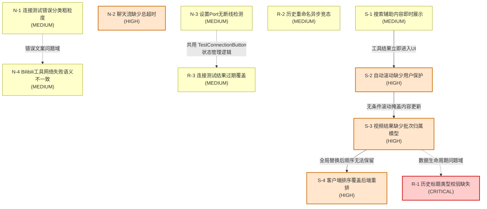

# 问题关联图

本文件使用 Mermaid 语法绘制12个已确认问题之间的依赖与关联关系，并辅以文字说明。问题编号对应总索引 README 中的统计表。

## 问题依赖关系图

## 跨文档关联说明

### 关联一：N-3 与 R-3 共用 TestConnectionButton 状态管理

N-3 指出设置页 Port 未注册 `onDisconnect` 处理，缺少心跳机制；R-3 指出连接测试的 `Promise.race` 在视图切换后仍可能写入过期状态。两者共同涉及 `Main/src/components/model-settings/TestConnectionButton.tsx:115-189` 的状态管理逻辑。

- N-3 关注的是 Port 断线检测能力缺失，导致断线反馈延迟。
- R-3 关注的是异步 Promise 完成时机晚于视图切换，导致结果覆盖新状态。
- 两者的共同点是：连接测试期间发生的异步事件（Port 断开或 Promise 完成）在组件状态已经变化后仍可能写入旧状态。修复时应统一考虑断线检测和 Promise 取消两个维度。

### 关联二：N-1 与 N-4 共同形成"错误文案无法区分根因"问题域

N-1 指出连接测试中 `inferErrorCode` 将未识别异常统一归类为 `NETWORK_ERROR`，UI 显示"网络连接失败"；N-4 指出 Bilibili 工具网络失败走 `tool-error` 路径，显示"工具 bilibili_search 执行失败"并终止流。

- 两者面对的网络失败场景相似（Provider 不可达、DNS 错误等），但错误文案和用户感知完全不同。
- N-1 的用户看到"网络连接失败"，无法判断应检查网络、API Key、Base URL 还是模型名。
- N-4 的用户看到工具执行失败，可能误以为是搜索本身无结果而非网络问题。
- 共性根因是：网络层错误分类没有统一的语义层，不同调用路径（连接测试 vs 工具调用）各自处理网络异常，导致用户无法从文案推断实际根因。

### 关联三：S-3 与 R-1 都涉及"数据生命周期管理"问题域

S-3 指出视频结果通过 `SET_VIDEOS` 直接替换全局数组，没有批次归属和消息锚点；R-1 指出历史记录从存储读取后未逐条校验 `title` 字段类型，直接强转为 `ConversationRecord[]`。

- 两者共性是：外部数据进入前端状态时缺少结构校验或归属模型。
- S-3 是视频数据缺少批次标识，导致旧视频被新搜索覆盖。
- R-1 是历史数据缺少字段类型校验，导致非字符串 `title` 在渲染时抛出 `TypeError`。
- 修复时应建立统一的数据入口校验层，对外部存储和跨标签页同步的数据进行结构完整性检查。

### 关联四：S-1 到 S-4 的因果链

搜索结果展示的四个问题形成一条逐级传导的因果链：

1. **S-1（即时展示）**：`stream.ts:182-220` 在工具结果到达后立即推送 `videos` 和 `insight` 消息，不等待最终 `tool_result`。这导致 UI 在搜索过程中就出现视频网格和 insight 卡片。
2. **S-2（无条件滚动）**：由于 S-1 持续推送新内容，`MessageList.tsx:93-96` 的 effect 在 `renderItems.length`、`streamingContent`、`streamingReasoning` 和 `videos` 任一变化时无条件滚动到底部。即时展示加剧了滚动频率，用户无法稳定阅读上方内容。
3. **S-3（全局替换）**：由于 S-1 的即时推送和 S-2 的滚动掩盖，用户更难察觉 `SET_VIDEOS` 直接替换全局数组的行为。新搜索覆盖旧视频时，滚动行为进一步掩盖了视觉变化，用户感知为"卡片被顶掉"。
4. **S-4（排序覆盖）**：由于 S-3 的全局替换产生了新的数组引用，`MessageList.tsx:49-56` 会重置用户手动排序选择为默认播放量排序，`applySortAndFilter` 覆盖后端重排顺序。最终用户看到的卡片顺序既不是后端重排结果，也不是用户手动选择，而是默认播放量排序。

这条因果链说明：搜索结果展示的四个问题不是孤立缺陷，而是从数据推送时机到最终渲染顺序的完整链路上逐级放大。修复时应从 S-1 的推送时机和 S-3 的数据模型入手，而非仅修补末端的排序覆盖。

## 独立问题说明

以下问题不与其他问题形成强关联，属于独立缺陷：

- **N-2（聊天流缺少总超时）**：`stream.ts:315-329` 创建的 `AbortController` 未设置 `AbortSignal.timeout`，与 Port 心跳机制独立。Port 心跳检测的是 content script 与 service worker 通道存活，不能替代上游 AI 请求的超时。
- **R-2（历史重命名异步竞态）**：`HistoryDropdown.tsx:172-194` 的 `handleRenameConfirm` 在 `await onRename` 返回后才更新状态，与 R-3 同属异步竞态类问题，但触发场景独立（历史重命名 vs 连接测试），不形成因果链。
